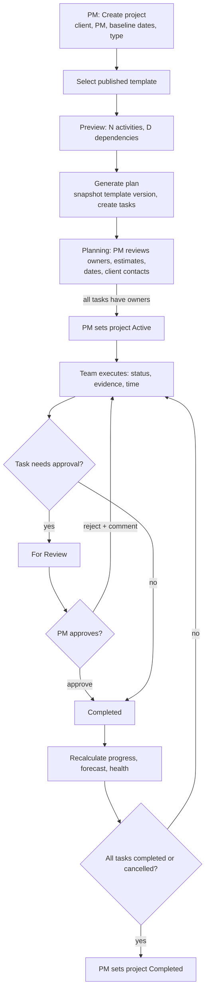
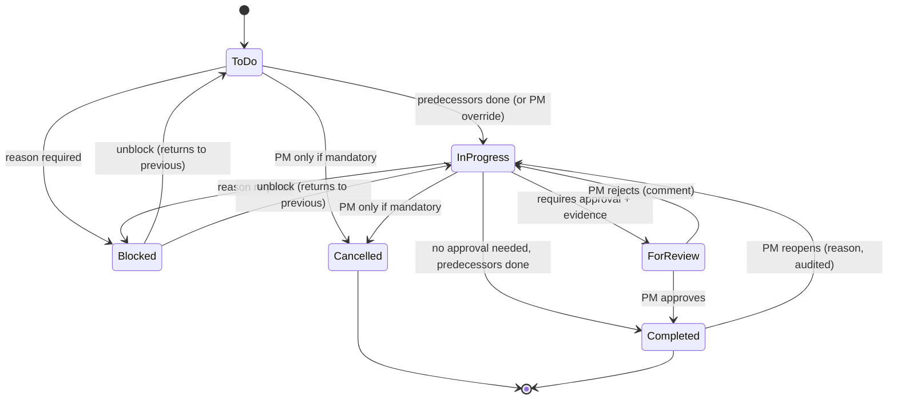
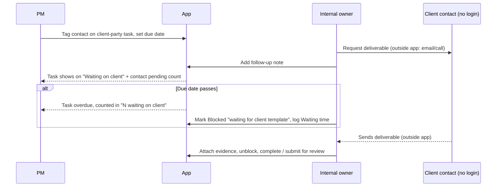

# 06 · Workflows

## 1. End-to-end project lifecycle

## 2. Task status state machine

## 3. Client dependency follow-up

Note: Phase 1 sends nothing to the client contact (pending Q-02).

## 4. Seed template: SAP Business One Implementation (from blueprint)
| # | Activity | Party | Default responsible | Deliverable / evidence | Depends on |
|---|----------|-------|---------------------|------------------------|-----------|
| 1 | Data gathering | Internal | Consultant | Completed data-gathering document | – |
| 2 | Submit master data template to client | Internal | Consultant | Template sent to client | 1 |
| 3 | Client master data – Items | Client | Client contact (owner: Consultant) | Completed items template | 2 |
| 4 | Client master data – Business Partners | Client | Client contact (owner: Consultant) | Completed BP template | 2 |
| 5 | Validate imported master data | Internal | Data specialist | Validation results and exceptions | 3, 4 |
| 6 | Configure system and validate setup | Internal | Technical specialist | Configuration evidence | 1 |
| 7 | User acceptance testing (UAT) | Internal + client participants | QA / Consultant | Test results and sign-off | 5, 6 |
| 8 | End-user training | Internal | Trainer / Consultant | Training completion record | 7 |
| 9 | Cutover preparation | Internal + client | Project team | Approved cutover checklist | 7 |
| 10 | Go-live and post-implementation support | Internal | Implementation & support teams | Go-live approval and handover | 8, 9 |

Dependencies above are a proposed default (the blueprint doesn't define them) and need confirmation (Q-06). Estimates and offsets are to be supplied by the implementation team (Q-06).

## 5. Time logging flow
1. User opens Time logging → week defaults to current week.
2. Selects project (only member projects) → task (open tasks only) → date → hours → type → notes.
3. Server validates (range, future date, daily total ≤ 24, membership, lock period).
4. Entry saved, task actual hours recalculated, audit entry written.
5. Weekly total and utilization update.

## 6. Template versioning
1. Admin/PM opens a Published template (vN) → "Edit" creates a working draft of vN+1.
2. Edits are saved to the draft; vN remains active for new projects until vN+1 is published.
3. Publish → vN+1 becomes the active version; vN is kept read-only.
4. Projects created from vN keep their snapshot; no migration happens automatically.

## 7. Document lifecycle
See the state diagram in [10 §6](10_DOCUMENT_MANAGEMENT.md).
