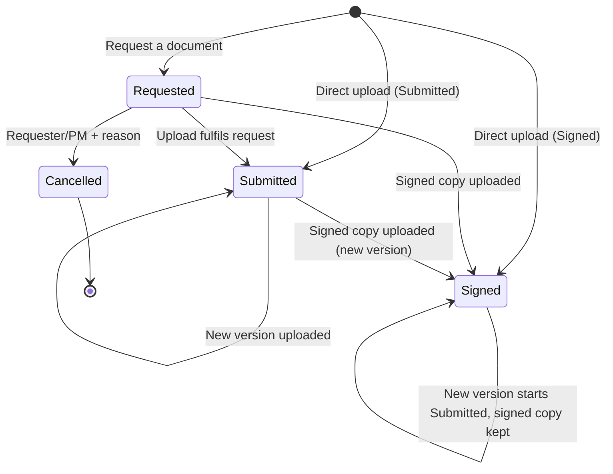

# 10 · Project Document Management (added in v0.2)

**Requested by:** Jomerson, 2026-10-09 · **Scope source:** Mockup v0.2 "Documents" screen and dialogs · **Phase:** 1 (storage and tracking only; in-app e-signature is deferred indefinitely (Jomerson, 2026-10-09))

Every document that personnel on a project request, submit, or sign is stored in the project's own folder tree, such as Contracts, one folder per phase, and custom folders, with a full record of who did what and when.

This file is the complete spec for the module. The other docs point here and reuse its IDs.

---

## 1. Business requirements
| ID | Requirement | Pri |
|----|-------------|-----|
| BR-16 | Store all project documents (contracts, phase deliverables, signed approvals, meeting minutes) in one place per project, organized in folders. | Must |
| BR-17 | Track each document's lifecycle (Requested, then Submitted, then Signed) with who requested it, who submitted it, who signed it, and when. | Must |
| BR-18 | Signed documents must never be silently changed or overwritten. Changes create a new version, and the signed copy is kept. | Must |
| BR-19 | Document access follows project and role permissions, enforced on the server. Client contacts can be named on documents but get no access. | Must |
| BR-20 | Requests for documents from client contacts count as client dependencies, so overdue requests show up in "Waiting on client". | Should |

## 2. Functional requirements

### DOC-F · Folders
| ID | Requirement | Pri |
|----|-------------|-----|
| FR-DOC-01 | Each project has a folder tree. On plan generation, default folders are created: **Contracts**, one folder per template phase (e.g. "Phase 1 – Data gathering"), plus any extra default folders defined on the template (e.g. "Meeting minutes"). | Must |
| FR-DOC-02 | Templates gain a `defaultFolders` list (name, order, optional parent), editable in the template editor and versioned with the template (FR-TPL-04). Contracts and phase folders are always included. | Must |
| FR-DOC-03 | Users with permission (§5) can create, rename, and move custom folders. Nesting is allowed up to 3 levels. Folder names must be unique within the same parent (case-insensitive). | Must |
| FR-DOC-04 | Default folders (Contracts, phase folders) can be renamed by a PM but not deleted. A custom folder can be deleted only when it's empty. | Must |
| FR-DOC-05 | The folder list shows the document count per folder. | Must |

### DOC-D · Documents and versions
| ID | Requirement | Pri |
|----|-------------|-----|
| FR-DOC-10 | Document record: name*, folder*, description, status, requires-signature flag, requested-by, requested-from (internal user **or** client contact), due date, linked task (optional), versions[], lifecycle events[], created/updated timestamps. | Must |
| FR-DOC-11 | **Version:** version number (v1, v2, …), file (storage key, original file name, size, MIME type, SHA-256 checksum), uploaded-by, uploaded-at, status at upload (Submitted or Signed), optional note. | Must |
| FR-DOC-12 | Uploading a file whose name matches an existing document in the same folder offers **"Add as new version"** (the default) or **"Keep both"** (which saves it with a " (2)" suffix). It never overwrites. | Must |
| FR-DOC-13 | Allowed file types: PDF, DOCX, XLSX, PNG, JPG/JPEG (see Q-22 about others). The server checks the extension **and** the detected content type. Max **25 MiB (26,214,400 bytes)** per file. Error messages: "That file type isn't allowed." and "Files must be 25 MB or smaller." | Must |
| FR-DOC-14 | All versions are listed with uploader, date, and status. Any version can be downloaded by an authorized user. The latest Signed version is labelled "Signed copy". | Must |
| FR-DOC-15 | Search documents by name within a project. Filter a folder by status (All, Requested, Submitted, Signed) with counts. | Must |
| FR-DOC-16 | A document can be linked to a task. The task panel lists its linked documents, and the document shows its task. | Should |
| FR-DOC-17 | Task evidence files (FR-TSK-07) are stored as documents in the matching phase folder and linked to the task, so every project file is in one place (see Q-23). | Should |
| FR-DOC-18 | Moving a document to another folder within the same project is allowed and audited. Moving it to another project isn't allowed. | Should |

### DOC-S · Lifecycle (Requested, then Submitted, then Signed)
| ID | Requirement | Pri |
|----|-------------|-----|
| FR-DOC-20 | **Request a document:** document name*, folder*, due date* (today or later), requested-from* (a project member or an active contact of the project's client), linked task (optional), requires-signature (default on in Contracts, off elsewhere). This creates a document in status **Requested** with no file. | Must |
| FR-DOC-21 | **Upload:** the uploader picks the folder, the file, and the status (**Submitted** or **Signed**), and optionally "Fulfils request" (a Requested document in the project). Fulfilling a request adds v1 to that document and moves it forward. | Must |
| FR-DOC-22 | Status only moves forward: Requested to Submitted to Signed, and Requested straight to Signed when a signed copy is uploaded directly. Documents that don't require a signature are complete at Submitted. No status can move backward (server). | Must |
| FR-DOC-23 | A Requested document can be **Cancelled** by its requester or the PM, with a reason. A cancelled request is kept read-only and is never deleted. | Must |
| FR-DOC-24 | Every status change, upload, and new version is recorded as a lifecycle event (event, actor, on-behalf-of, timestamp, version, note) and also written to the audit log (FR-AUD-01). | Must |
| FR-DOC-25 | **Signing on behalf of a client contact:** when a document is marked Signed by a client contact, the record stores the signer as that contact and **recorded-by** as the internal user who uploaded it. It displays as "by R. Santos (client, recorded by J. Nazaire)". | Must |
| FR-DOC-26 | Overdue request = status Requested, due date < today, not cancelled. Overdue requests from client contacts count in the Dashboard "Waiting on client" list and in the contact's pending items (FR-CLI-05, FR-DASH-03). Overdue requests from internal users appear in that user's My tasks (FR-TSK-13). | Should |

### DOC-L · Locking and integrity
| ID | Requirement | Pri |
|----|-------------|-----|
| FR-DOC-30 | A **Signed** version is locked. Its file, metadata, and lifecycle events can't be edited, replaced, or deleted by anyone through the UI or the API (server). | Must |
| FR-DOC-31 | Changing a signed document means uploading a **new version**. That version starts at Submitted, the earlier signed version is kept as the "Signed copy", and the document shows both, e.g. "Signed (v3) · v4 Submitted". | Must |
| FR-DOC-32 | Unsigned documents and versions can't be hard-deleted in Phase 1. PM or Admin can **archive** a document with a reason. Archived documents are hidden by default, restorable, and audited. | Must |
| FR-DOC-33 | Each file's SHA-256 checksum is stored on upload and can be shown to prove the stored copy hasn't changed. | Should |

### DOC-A · Access
| ID | Requirement | Pri |
|----|-------------|-----|
| FR-DOC-40 | Every list, metadata, upload, and download request checks the user's role and project membership on the server (§5). | Must |
| FR-DOC-41 | Downloads go through an authorized API call that returns a **short-lived signed URL** (≤ 5 minutes, single file). Storage containers are private. A copied link stops working after it expires, and storage keys can't be guessed. | Must |
| FR-DOC-42 | Client contacts can appear as requested-from or signer, but have no account, link, or download access. The UI shows the notice "Client contacts can be named on a document but have no access." | Must |
| FR-DOC-43 | Folder-level restriction (e.g. Contracts visible only to the PM, Admin, and selected members). This is **Could** for Phase 1, pending Q-21. | Could |

## 3. User stories
| ID | Story | FRs | Pri |
|----|-------|-----|-----|
| US-24 | As a PM, I want each new project to start with Contracts and phase folders so that documents are organized the same way on every project. | DOC-01, 02, 05 | Must |
| US-25 | As a project member, I want to add custom folders such as Meeting minutes so that I can organize project-specific files. | DOC-03, 04 | Must |
| US-26 | As a PM or consultant, I want to request a document from a team member or client contact with a due date so that missing documents are tracked. | DOC-20, 23, 26 | Must |
| US-27 | As a project member, I want to upload a document as Submitted or Signed, optionally fulfilling a request, so that the project has the latest file and its status. | DOC-11, 12, 13, 21, 22 | Must |
| US-28 | As a PM, I want to see who requested, submitted, and signed each document and when, so that I have proof of approvals. | DOC-24, 25 | Must |
| US-29 | As a PM, I want signed documents locked and changes kept as new versions so that a signed contract can never be altered. | DOC-30, 31, 33 | Must |
| US-30 | As a project member, I want to find a document by name or status and download any version I'm allowed to see. | DOC-14, 15, 41 | Must |
| US-31 | As a PM, I want document access to follow project permissions, with client contacts having none, so that confidential files stay protected. | DOC-40, 41, 42 | Must |
| US-32 | As a team member, I want documents linked to tasks so that evidence and deliverables are easy to find from the checklist. | DOC-16, 17 | Should |

## 4. Acceptance criteria
**US-24**
- **AC-24.1** Given a template with 4 phases, when a project is generated, then the project has Contracts, 4 phase folders named after the phases, and the template's extra default folders.
- **AC-24.2** A PM can rename a default folder but can't delete it, so there's no delete option and the API returns 400.
- **AC-24.3** Editing a template's default folders creates a new template version and doesn't change existing projects' folders.

**US-25**
- **AC-25.1** Creating a folder with a name that already exists in the same parent, ignoring case, is rejected.
- **AC-25.2** A 4th level of nesting is rejected.
- **AC-25.3** Deleting a non-empty custom folder is blocked with "Move or archive its documents first."

**US-26**
- **AC-26.1** Document name, folder, due date, and requested-from are required, and a due date in the past is rejected.
- **AC-26.2** The requested-from picker lists only project members and active contacts of the project's client.
- **AC-26.3** Once saved, the document shows status Requested, "Waiting on {name} · due {date}", and a lifecycle event "Requested by {user}".
- **AC-26.4** A client request that passes its due date appears in the Dashboard "Waiting on client" list and in the contact's overdue count.
- **AC-26.5** Cancelling needs a reason. The document becomes read-only, is labelled Cancelled, and stays visible under the All filter.

**US-27**
- **AC-27.1** A file of exactly 26,214,400 bytes is accepted, and one of 26,214,401 bytes is rejected with "Files must be 25 MB or smaller."
- **AC-27.2 (API)** A `.exe` renamed to `.pdf` is rejected based on its detected content type.
- **AC-27.3** Uploading "Statement of Work.pdf" into a folder that already has it offers "Add as new version" by default, and the result is v(n+1) with v(n) unchanged.
- **AC-27.4** Uploading with "Fulfils request: NDA – Acme Trading" moves that document from Requested to Submitted or Signed, depending on the chosen status.
- **AC-27.5 (API)** Moving a Submitted or Signed document back to Requested, or a Signed document back to Submitted, returns 400.

**US-28**
- **AC-28.1** The document panel shows each lifecycle step with actor and timestamp in the user's timezone, e.g. "Signed · by R. Santos (client, recorded by J. Nazaire) · Sep 02, 3:14 PM".
- **AC-28.2** Each event also appears in the project Activity log.

**US-29**
- **AC-29.1 (API)** Calls that edit, replace, or delete a Signed version's file or metadata return 403 or 400, for Admin too.
- **AC-29.2** Uploading a change to a signed document creates a new Submitted version, while the earlier version stays labelled "Signed copy" and can still be downloaded.
- **AC-29.3** The checksum shown for a version matches the SHA-256 of the downloaded file.

**US-30**
- **AC-30.1** Status filter counts match the documents in the folder.
- **AC-30.2** Search finds documents by partial name within the project only.

**US-31**
- **AC-31.1 (API)** A user who isn't a member of the project gets 403 on list, metadata, upload, and download-URL endpoints.
- **AC-31.2** A download URL used after 5 minutes fails, and so does one used by a user who wasn't signed in.
- **AC-31.3 (API)** No endpoint issues a download URL to, or authenticates, a client contact identity.

**US-32**
- **AC-32.1** Evidence uploaded on a task appears in the matching phase folder with a link back to the task, and vice versa.

## 5. Permissions (extends 07 §4)
| Action | Admin | PM (own project) | Member (project) | Viewer |
|--------|:----:|:----:|:----:|:----:|
| View folders and documents, download | ✓ | ✓ | ✓ | ✓ (Q-21) |
| Create, rename, or move custom folders | ✓ | ✓ | ✓ | – |
| Rename default folders | ✓ | ✓ | – | – |
| Request a document | ✓ | ✓ | ✓ | – |
| Upload, add a version, fulfil a request | ✓ | ✓ | ✓ | – |
| Mark Signed on behalf of a client contact | ✓ | ✓ | ✓ (recorded-by is stored) | – |
| Cancel a request | ✓ | ✓ | own requests | – |
| Archive or restore a document | ✓ | ✓ | – | – |
| Edit or delete a Signed version | – | – | – | – |

## 6. Workflow

## 7. Technical notes (for Deven)
- **Database:** MongoDB, as Lean confirmed. New collections:
  - `projectFolders` holds projectId, name, parentId, isDefault, defaultType (contracts | phase | template), phaseRef, order, and createdBy. Index (projectId, parentId, nameLower) as unique.
  - `documents` holds projectId, folderId, name, nameLower, description, status, requiresSignature, requestedBy, requestedFrom {kind: user|contact, id}, dueDate, taskId, currentVersion, lastSignedVersion, archived, versions[], and events[]. Index (projectId, folderId, status), (projectId, nameLower), (requestedFrom.id, status, dueDate), and taskId.
  - `versions[]` holds no, storageKey, originalName, size, mime, sha256, uploadedBy, uploadedAt, statusAtUpload, note, and locked.
  - `events[]` holds type, actorId, onBehalfOf {kind, id}, at, versionNo, and note.
  - If version arrays could grow large, use a separate `documentVersions` collection. That's Deven's call.
- **Files:** private Azure Blob or S3 container, with storage keys `projects/{projectId}/{documentId}/{versionNo}-{uuid}`. Turn on object versioning or immutability (WORM/legal hold) for Signed versions where the provider supports it.
- **Uploads:** stream through the API, or use a pre-signed upload URL with server-side finalize. Either way, validate size and type, compute SHA-256 before marking the upload complete, and leave no orphan metadata if the upload fails.
- **Downloads:** check permissions in the API, then issue a signed URL that expires in ≤ 5 minutes, using `Content-Disposition: attachment` and the original file name.
- **Malware scan** (Should): scan uploads (e.g. ClamAV or the cloud provider's scanner) before they can be downloaded, and show a "Scanning…" state.
- **Concurrency:** assign version numbers atomically (a `findOneAndUpdate` on currentVersion) so two simultaneous uploads get v4 and v5, never two v4s.
- **API (indicative):** `/projects/:id/folders`, `/projects/:id/documents`, `/documents/:id`, `/documents/:id/versions` (POST upload), `/documents/:id/versions/:no/download-url`, `/documents/:id/sign`, `/documents/:id/cancel`, `/documents/:id/archive`.
- **NFR:** an upload of up to 25 MB finishes in < 10 s on a 20 Mbps connection, and the document list loads in < 1 s for 1,000 documents per project.

## 8. Edge cases
| ID | Scenario | Expected |
|----|----------|----------|
| EC-39 | Two people upload the same file name to the same folder at the same time | Both kept as consecutive versions (v4, v5), never two v4s |
| EC-40 | Upload interrupted or fails the virus scan | No version is created, or it's marked failed and can't be downloaded. A clear error is shown |
| EC-41 | File exactly 26,214,400 bytes, or 0 bytes | 26,214,400 bytes accepted. 0 bytes rejected with "The file is empty." |
| EC-42 | Wrong extension, e.g. a `.docx` that's really a zip of executables, or a `.pdf` that's really HTML | Rejected based on its content type |
| EC-43 | Very long file name (> 200 chars), or names with emoji, `/`, `\`, `..`, or non-ASCII (ñ) | Unsafe characters cleaned for storage, original name kept for display, name trimmed to 200 chars |
| EC-44 | A client contact who has a pending request is deactivated | The request keeps showing the contact as "(inactive)", and the PM is asked to reassign or cancel it |
| EC-45 | A project member who uploaded documents is removed from the project | Their documents and events stay, and they lose access |
| EC-46 | Fulfilling a request that someone else cancelled a moment earlier | Upload refused with "This request was cancelled". The user can upload it as a new document instead |
| EC-47 | A download URL is shared outside the company | It expires within 5 minutes. A new URL requires an authorized API call |
| EC-48 | Template phase renamed in a new template version | Existing projects keep their folder names, because the project uses its snapshot |
| EC-49 | A phase folder holds evidence linked to a task that's later cancelled | The document stays, still linked to the cancelled task |
| EC-50 | A document marked Signed with requires-signature off | Allowed. Signed is still the final, locked status |
| EC-51 | Project Completed or Cancelled | Documents become read-only, except for PM/Admin archiving (Q-24) |

## 9. Open questions (added in v0.2)
| ID | Question | Proposed default |
|----|----------|------------------|
| Q-20 ★ | In Phase 1, should people sign outside the app and upload the signed copy, or sign in-app with an e-signature service like DocuSign or Adobe Sign? | Sign outside the app and upload the copy. In-app e-signature in Phase 2 **✅ RESOLVED 2026-10-09 (Jomerson): default accepted.** |
| Q-21 | Should Contracts, or other folders, be restricted to the PM and Admin, or can all project members and Viewers see them? | All project members can see everything in Phase 1. Restricted folders come later |
| Q-22 | Beyond PDF, DOCX, XLSX, PNG, and JPG, do you need CSV, ZIP, PPTX, MSG/EML (emails), or older DOC/XLS files? | Add CSV and PPTX. No ZIP unless it's needed |
| Q-23 | Should task evidence be stored in the document folders so every file is in one place? | Yes |
| Q-24 | How long must documents be kept after a project ends, and can anyone ever delete them? | Kept indefinitely, archive only, no hard delete |
| Q-25 | Is there a per-project or company storage quota? | No quota in Phase 1, and usage shown to Admin |
