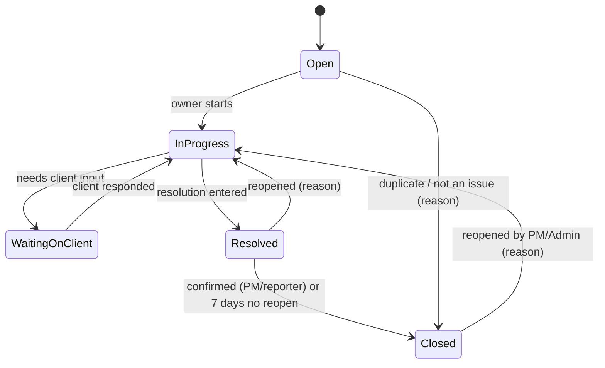

# 13 — Project Issue Tracking (Milestone 3.5)

**Status:** v0.6.0 approved by Jomerson with Q-32 to Q-35 defaults (2026-10-09) · **Author:** Rich · **Date:** 2026-10-09
**Source:** Jomerson ("monitor all issues raised before and after the services"); Deven (scope); Queen (access grid, completed projects); Lean (decisions: grid rows; Completed = issues open, Archived = read-only); UIE (v0.7 plan).
**Reference practice:** issue/ticket handling in tools like Jira Service Management, Zendesk and SAP Solution Manager: severity-based response targets, a status workflow with a "waiting on customer" state, and separating implementation issues from post-go-live support.

## 1. Scope
In: issues per project (before and after go-live), an All issues page, status workflow, severity and due dates, attachments (M3 upload rules), comments, links to tasks and conversation messages, notifications, access rules rows, issue reports on the dashboard (M4).
Out (Phase 2+): client self-service portal or raising issues by email, SLA clocks with business-hours pausing, automatic escalation, merging duplicate issues, time logged directly against issues (see Q-34).

## 2. Business requirements
| ID | Requirement |
|----|-------------|
| BR-28 | Every issue raised on a project, during implementation or in post-go-live support, is recorded, owned and tracked to closure. |
| BR-29 | PMs and Admins can see all open issues across projects, with overdue and critical ones standing out. |
| BR-30 | Support continues on completed projects without reopening the project plan. |

## 3. Issue record
| Field | Rules |
|-------|-------|
| ID | Per project, e.g. `ACME-SAP-ISS-012` (project code + running number); never reused |
| Title | Required, up to 150 characters |
| Description | Required, plain text up to 10,000 characters |
| Stage | **Before go-live** or **After go-live**; defaults from project status (Completed → After go-live), editable |
| Category | Bug / Configuration / Data / Training / Change request / Other |
| Severity | **Critical, High, Medium, Low** (definitions in §4) |
| Status | Open → In progress → Waiting on client → Resolved → Closed (§5) |
| Reported by | Internal user (required) and optionally a client contact of the project's client (the contact doesn't log in) |
| Owner | Internal user on the project (required before In progress) |
| Due date | Defaults from severity (§4), editable with a reason |
| Links | Optional related task(s) and conversation message(s) of the same project |
| Attachments | M3 rules: PDF, Word, Excel; real-type check; 25 MiB; stored in a project "Issues" folder |
| Resolution | Required text when moving to Resolved |

## 4. Severity and default due dates (proposed, Q-32)
| Severity | Meaning | Default due |
|----------|---------|-------------|
| Critical | System down or blocks go-live / business operations, no workaround | 1 working day |
| High | Major function broken, workaround is painful | 3 working days |
| Medium | Function affected, workaround exists | 7 working days |
| Low | Cosmetic, question, minor | 15 working days |
Working days use the Q-07 calendar (Mon–Fri plus PH holidays).

## 5. Status workflow

## 6. Functional requirements
| ID | Requirement | Priority |
|----|-------------|----------|
| FR-ISS-01 | Each project has an **Issues** tab listing its issues with ID, title, severity, status, owner, client contact, due date, stage; filter by status, severity, owner, stage, category; sort by any column. | Must |
| FR-ISS-02 | An **All issues** page lists issues across all projects the user can view, with the same filters plus project and client; Members see only projects they're on (API-enforced). | Must |
| FR-ISS-03 | Create and edit issues with the fields in §3; validation as listed. | Must |
| FR-ISS-04 | Status changes follow §5 only; invalid transitions return 422. Resolved needs a resolution; reopen and close-as-duplicate need a reason. | Must |
| FR-ISS-05 | Due date defaults from severity (§4); changing severity recalculates it unless it was set by hand. Overdue = due date passed and status not Resolved/Closed; overdue and Critical issues are highlighted. | Must |
| FR-ISS-06 | Resolved issues auto-close after 7 days with no reopen (proposed, Q-33). | Should |
| FR-ISS-07 | Comment thread per issue: plain text, permanent (same rule as conversations, FR-CNV-03). | Must |
| FR-ISS-08 | Attachments follow FR-EVD-01 to 04 and go in the project's "Issues" folder in Documents. | Must |
| FR-ISS-09 | Link an issue to tasks and conversation messages in the same project; the task panel shows linked open issues. | Must |
| FR-ISS-10 | **Notifications (M3 system):** on create, notify the owner and PM; on assignment, the new owner; on status change and new comment, the owner, reporter and PM (except the actor); daily in-app reminder to the owner for overdue issues. | Must |
| FR-ISS-11 | Every change (field, status, owner, severity, due date) is audited and shown in the issue's history and the project Activity log. | Must |
| FR-ISS-12 | **Completed projects (Lean):** issues can be raised, updated, commented on and closed; the rest of the project stays read-only. A banner reads "This project is completed. Issues stay open for support." | Must |
| FR-ISS-13 | **Archived projects (Lean):** fully read-only, issues included; open issues must be closed or the project unarchived first. Archiving a project with open issues warns and lists them. | Must |
| FR-ISS-14 | **On Hold projects:** issues can still be raised and updated (proposed; issues often explain the hold). | Should |
| FR-ISS-15 | Issues can't be deleted by anyone except Admins (Delete on `issues`); "Closed – duplicate/not an issue" is the normal path. | Must |
| FR-ISS-16 | M4 dashboard and reports: open issues by severity and stage, overdue issues, average time to resolve, issues per client. | Should |
| FR-ISS-17 | Export the filtered issue list to CSV/Excel. | Could |

## 7. Access rules (doc 11 grid additions — Queen, Lean)
| Record type | Admin | PM | Member | Viewer | Notes |
|-------------|-------|----|--------|--------|-------|
| `issues` | VCED | VCE | VCE (own projects) | V | Members edit issues they own or reported; PM edits on projects they can view per Q-12 rule (own projects) |
| `conversations` | VC | VC | VC (own projects) | V | Edit/Delete n/a (permanent); Admin "hide" per Q-31 |
| `notifications` | own | own | own | own | Fixed row, not configurable; users only ever see their own |
Scope limits from FR-ACL-07 apply. Delete on `issues` is Admin-only by default and locked off for Viewer.

## 8. User stories
- **US-42** As a consultant, I want to log an issue the client raised during UAT, with severity and the client contact, so it isn't lost.
- **US-43** As a PM, I want one list of all open issues across my projects, so I can see what's critical or overdue.
- **US-44** As a support consultant, I want to keep handling issues after go-live on a completed project.
- **US-45** As an issue owner, I want to be notified when an issue is assigned to me or updated.

## 9. Acceptance criteria
- **AC-42.1** Creating an issue without title, description, severity or stage fails with field errors; a valid one gets the next ID for that project.
- **AC-42.2** A Critical issue created on Friday gets a due date of the next working day (Monday unless a holiday).
- **AC-42.3** Moving Open → Resolved directly returns 422; Resolved without resolution text returns 422. **(API)**
- **AC-43.1** All issues for member@ lists only issues on projects they're on; a direct GET of another project's issue returns 404. **(API)**
- **AC-43.2** An issue past its due date and not Resolved/Closed is flagged overdue in the list and on the dashboard.
- **AC-44.1** On a Completed project, creating and updating an issue works while editing a task returns 403/422. **(API)**
- **AC-44.2** On an Archived project, creating or updating an issue is refused. **(API)**
- **AC-45.1** Assigning an issue notifies the new owner once; the person assigning gets no notification.
- **AC-45.2** A Viewer can read issues but every write returns 403. **(API)**
- **AC-45.3** Attachments enforce the M3 rules (type check, 25 MiB). **(API)**

## 10. Edge cases
- **EC-66** Owner deactivated or removed from the project: their open issues show "Owner needed" and the PM is notified.
- **EC-67** Client contact on an issue is deactivated: the issue keeps the contact, marked inactive.
- **EC-68** Project's client changed: issues keep their contacts; a warning lists issues with contacts from the old client.
- **EC-69** Linked task deleted or moved: the link shows "Task removed"; the issue is unaffected.
- **EC-70** Two people change status at once: the second gets 409.
- **EC-71** A project is unarchived: its issues become editable again by the same rules.
- **EC-72** Severity lowered after the default due date passed: due date recalculates from creation date and may already be overdue.

## 11. Open questions and assumptions
- **Q-32** Are the severity definitions and default due dates in §4 right for Xceler8's support commitments? Proposed as listed.
- **Q-33** Auto-close Resolved issues after 7 days? Proposed: yes.
- **Q-34** Should time be logged against issues (especially after go-live, for support billing)? Proposed: not in 3.5; log time on a "Post go-live support" task. Revisit with M4 reports.
- **Q-35** Can issues be raised on On Hold projects? Proposed: yes (FR-ISS-14).
- **A-15** Client contacts never see or raise issues themselves; an internal user records issues on their behalf (client portal stays out of scope).
- **A-16** Issue tracking reuses M3's upload, notification and permanent-comment building blocks, so M3 must ship first.

## 12. Build decisions (PR #7, confirmed by Rich 2026-10-09)
- PMs outside a project can view its issues but can't raise or edit them (consistent with Q-12).
- A task or phase can be deleted only when nothing is recorded under it (server-checked). Phases aren't separate records, so a phase can be deleted once it has no tasks and no documents.
- Deferred to Milestone 4: issue dashboards and reports (FR-ISS-16), EC-66, EC-68, and linking conversation messages to an issue from the screen (FR-ISS-09, partly).
