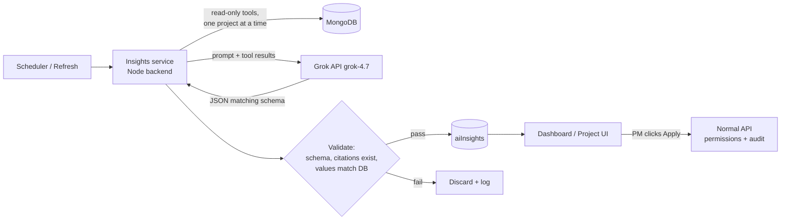

# 01 · AI Insights with Grok (Phase 2 research draft)

## 1. What the blueprint asks for
- A **Project Manager AI** (orchestrator) plus four specialist roles: Implementation Researcher, Timeline & Resource Analyst, QA & Compliance, and Timesheet & Productivity Analyst. These can be *logical* agents run by one backend service, not separate apps or subscriptions.
- Governance rules:
  1. Every recommendation cites the project facts, tasks, dates, and hour entries behind it.
  2. PMs approve consequential changes to owners, deadlines, scope, and milestones.
  3. Routine reminders and summaries may be automated under configured rules.
  4. API keys stay on the server, and agents get only the tools and data they need.
- Phase 2 covers "initial AI analysis". Phase 3 covers automated risk detection, AI-generated checklists, reminders, and forecasting.
- Jomerson accepted the default for Q-03: **recommendations only** to start.

## 2. Grok API facts relevant to the design
Source: [Grok 4.7 developer guide](https://docs.x.ai/developers/grok-4-7), [API pricing](https://docs.x.ai/developers/pricing), [models](https://docs.x.ai/developers/models), all checked 2026-10-09.

| Item | Detail |
|------|--------|
| Recommended model | `grok-4.7` (released to the API on 2026-09-21) |
| Context window | 500,000 tokens |
| Price (prompts under 200K tokens) | $2.00 per 1M input tokens, $0.50 per 1M cached input, $6.00 per 1M output. Prompts over 200K cost double |
| Features we need | Function calling (tools) and structured outputs with a strict JSON schema |
| Reasoning effort | low, medium, high (the default), or xhigh. Lower effort cuts cost and latency |
| Prompt caching | Set `prompt_cache_key` so repeated system prompts hit the cache |
| Regional endpoint | `us.api.x.ai` keeps inference in the US at a 10% premium. There's no APAC endpoint listed |
| Server-side tools | Web search and similar tools cost about $5 per 1,000 calls. **We don't need them**, because our data comes from our own database |
| Gateways | Also available through Vercel's AI Gateway and OpenRouter |

## 3. Recommended Phase 2 scope: "AI Insights v1"
Use one backend **insights service** that runs the specialist roles as separate prompts with read-only tools. Each one returns structured findings that a PM reviews in the UI. Build them in this order, because each needs only data Phase 1 already collects:

| # | Insight | Agent role | Data used | Example (from mockup) |
|---|---------|-----------|-----------|-----------------------|
| 1 | Overdue and blocked client deliverables | Timeline & Resource | tasks (party = Client, status, due date), documents (Requested, due) | "Acme master data is 6 days late" |
| 2 | Over-capacity people next 1–2 weeks | Timeline & Resource | tasks (owner, due, remaining estimate), users (capacity) | "Maria is over capacity next week. Suggest moving UAT prep to Ken" |
| 3 | Effort overruns and rework patterns | Timesheet & Productivity | timeEntries (type), tasks (estimate) | "UAT defect fixing ran 80% over estimate" |
| 4 | Schedule slippage and its cause | Timeline & Resource | baseline vs forecast, dependency chain | "Go-live at risk: tasks 5–7 depend on blocked task 3" |
| 5 | Project health summary (weekly) | PM orchestrator | outputs of 1–4 + audit log | A short status narrative for the PM to edit and share |
| 6 | Missing mandatory evidence or approvals | QA & Compliance | tasks (mandatory, requires approval, evidence), documents | "UAT sign-off has no evidence attached" |

The Implementation Researcher agent, which generates checklists from a description, fits Phase 3, since the blueprint lists AI-generated checklists there.

### Functional requirements (draft)
| ID | Requirement |
|----|-------------|
| FR-AI-01 | Insights run on a schedule (default: daily at 07:00 Asia/Manila per active project) and on demand from the dashboard ("Refresh insights"), with a limit of 1 manual refresh per project every 15 minutes. |
| FR-AI-02 | Every insight is stored in `aiInsights` with: type, severity (info/warning/critical), title, explanation, **citations** (task, time entry, document, and project IDs with the values used), suggested action, model, prompt version, token usage, created time, and status (New, Accepted, Dismissed, Done). |
| FR-AI-03 | An insight without at least one valid citation is discarded by the server before it's shown (see guardrails). |
| FR-AI-04 | Suggested actions that change data, like reassigning or moving a date, show as a **proposal**. The PM clicks Apply, and the normal API makes the change with normal permission checks and an audit entry tagged "suggested by AI insight #id". The AI never writes directly. |
| FR-AI-05 | The PM can dismiss an insight with an optional reason. Dismissed insights of the same type and target aren't re-raised for 7 days unless the data changes. |
| FR-AI-06 | The dashboard AI panel (the Phase 1 placeholder) shows the top 5 open insights across visible projects. The project detail page shows that project's insights. |
| FR-AI-07 | Users only see insights for projects they can already see. Insights never include data from other projects. |
| FR-AI-08 | Hours are never turned into a person-level performance score. Productivity insights are about tasks and projects, not ranking people (BR-13). |
| FR-AI-09 | Admin settings: turn AI on or off globally and per project, set the schedule, set a monthly token budget with alerts at 80% and 100% (it stops at 100%), and pick the reasoning effort. |
| FR-AI-10 | Show a "Generated by AI, check before acting" label on every insight. |

## 4. Guardrails and architecture

- **Read-only tools only**, such as `getProjectSummary`, `listOverdueTasks`, `getWorkload(week)`, `getEffortVariance`, and `getDependencyChain(taskId)`. Each one is scoped server-side to a single project ID. There are no write tools in Phase 2.
- **Citation check:** the server re-reads every cited record and checks that the quoted values, like a due date or hours, match the database. This keeps made-up facts out of the UI.
- **Data minimization:** send IDs, task names, dates, hours, and statuses. Don't send client contact emails or phone numbers, file contents, or follow-up note text unless a later feature needs them. Person names can be replaced with pseudonymous IDs and mapped back after the response (Q-AI-03).
- **Prompt injection:** task names, notes, and file names are user-entered text. Mark them as data in the prompt, and never let model output trigger actions without the PM clicking Apply.
- **Secrets:** keep `XAI_API_KEY` in Azure App Service settings or Key Vault, never in the React app or the repo.
- **Logging:** store the prompt version, model, token counts, and latency for each run. Don't log full prompts in production if they include personal data.
- **Fallback:** if the API fails or the budget runs out, the dashboard shows "Insights unavailable" and everything else keeps working.

## 5. Cost estimate (illustrative, not a quote)
These assumptions are for illustration only. Per daily run per project, assume about 30,000 input tokens (tool results and instructions) and about 3,000 output tokens, including reasoning.
- Per run: 30,000 × $2/1M + 3,000 × $6/1M ≈ **$0.08**
- 20 active projects × 22 working days ≈ 440 runs, about **$35 a month**, plus on-demand refreshes. Prompt caching and lower reasoning effort would bring this down.

We should measure real token use during a pilot before setting the budget.

## 6. Open questions
| ID | Question | Proposed default |
|----|----------|------------------|
| Q-AI-01 | Is it OK to send project data to xAI's API? Do we need a data processing agreement or client consent under the Data Privacy Act? | Get Jomerson's and legal's OK, send minimized data only, and review xAI's data terms |
| Q-AI-02 | Global endpoint or US regional endpoint (+10%)? | Global, unless a client contract requires otherwise |
| Q-AI-03 | Pseudonymize person names before sending? | Yes for client contacts. Internal names are allowed |
| Q-AI-04 | Who sees insights: PMs only, or members too? | PMs, Admins, and Viewers. Members see insights about their own tasks |
| Q-AI-05 | Monthly AI budget cap? | $50 a month during the pilot |
| Q-AI-06 | Should routine reminders (Phase 3) go by email? This depends on Phase 1 Q-02, where client emails are off | Phase 3 decision |
